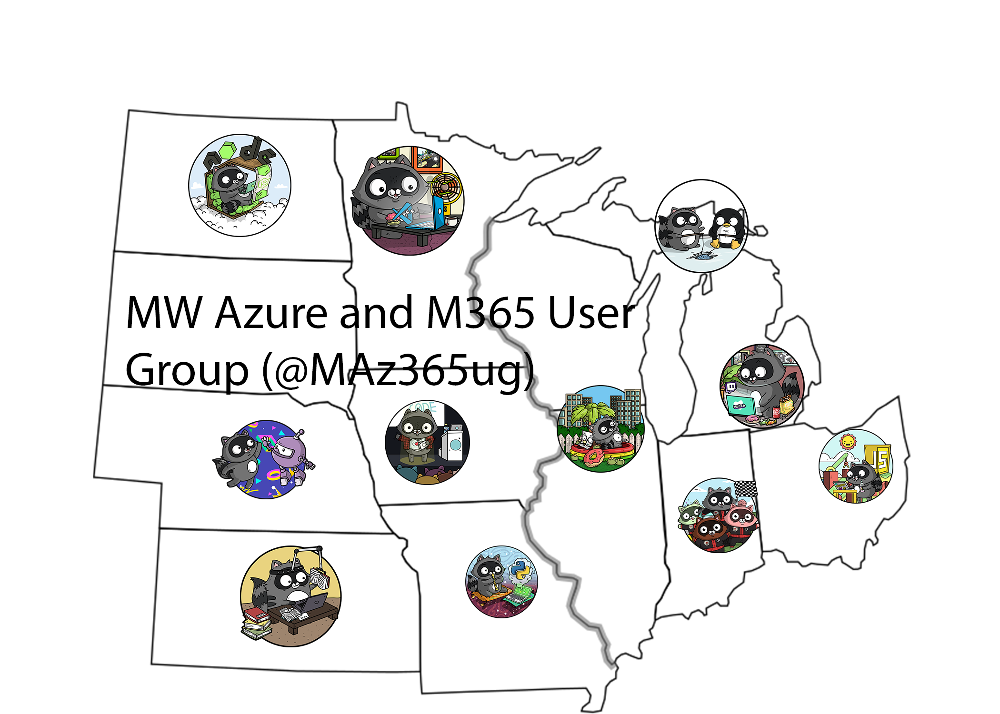

# Welcome to the Midwest Azure M365 User Group website

## **Group Mission**
- Create an inclusive learning environment for those interested in Cloud technologies on Azure and M365

- Provide content from global community members on a monthly basis

- Expand knowledge for users in Michigan, United States, and around the world

- Everyone is welcome to share session dates with their colleagues and contacts

- **No sales pitches, just information!**

## **Our Team**

**Dwayne Natwick**: (@DwayneNCloud) Microsoft MVP for Azure, Microsoft Certified Trainer (MCT) Regional Lead, Cloud Training Architect Lead at Opsgility. 

**Brian Gorman**: (@blgorman) MCSA, MCSD, MCT, Senior Cloud Training Architect @ Opsgility, Owner at MajorGuidanceSolutions

**Shannon Kuehn**: (@ShanKuehn) Senior Cloud Advocate, Azure Engineering at Microsoft

**Brette Bossick**: (@BretteMB) Founder & COO at Skylines Academy, Enabling and Empowering IT Teams to Adopt Cloud

**Nick Colyer**: (@vNickC) Chief Architect at Ahead, Co-Founder of Skylines Academy, Microsoft MVP 2020-2021, VMware vExpert, Microsoft Certified Trainer

## **Register and Follow** 

**Register here:** <a rel="noreferrer noopener" href="https://www.meetup.com/MW-Azure-and-M365-User-Group-Meetup" target="_blank">https://www.meetup.com/MW-Azure-and-M365-User-Group-Meetup</a>

**Join the LinkedIn Group:** <a rel="noreferrer noopener" href="https://www.linkedin.com/groups/12293597/" target="_blank">https://www.linkedin.com/groups/12293597/</a> 

**Follow on Twitter:** <a rel="noreferrer noopener" href="https://twitter.com/MAz365ug" target="_blank">https://twitter.com/MAz365ug</a>

**We still needing speakers for future events.  Submit your session request here:** <a rel="noreferrer noopener" href="https://sessionize.com/MI-azure-m365-user-group" target="_blank">https://sessionize.com/MI-azure-m365-user-group</a>

All past meetings are recorded and can be access here: <a rel="noreferrer noopener" href="https://www.youtube.com/c/CaptainHyperscaler/playlists" target="_blank">https://www.youtube.com/c/CaptainHyperscaler/playlists</a>

## Sessions 

**Session overviews:** <a rel="noreferrer noopener" href="https://sessionize.com/api/v2/c8xd84bp/view/Sessions" target="_blank">https://sessionize.com/api/v2/c8xd84bp/view/Sessions</a>

**Speaker bios:** <a rel="noreferrer noopener" href="https://sessionize.com/api/v2/c8xd84bp/view/SpeakerWall" target="_blank">https://sessionize.com/api/v2/c8xd84bp/view/SpeakerWall</a>

## Upcoming Sessions

**NEXT MEETING RESCHEDULED: February 10, 2021** at 12:30 PM US Eastern Time (UTC -4)- "Journey to a Secure AKS - Use AAD identity for pods and make your SecOps happy" with David Frappart. <a href="https://www.meetup.com/MW-Azure-and-M365-User-Group-Meetup/events" target="_blank">https://www.meetup.com/MW-Azure-and-M365-User-Group-Meetup/events.

**February 24, 2021** at 12:00 PM US Eastern Time (UTC -4)- "Introduction to Azure Cosmos DB" with Leonard Lobel.

**March 10, 2021** at 12:00 PM US Eastern Time (UTC -4)- "Data Modeling and Partitioning in Azure Cosmos DB" with Leonard Lobel.

**March 24, 2021** at 12 PM US Eastern Time (UTC -4) - "Endpoint Manager and Autopilot" with Shabaz Darr

**April 7, 2021** at 12 PM US Eastern Time (UTC -4) - "Data in Azure" with Matt Bradley

## Past Sessions

**June 17, 2020** - Guardians of your Microsoft Galaxy: 10 tips to make your Cloud eco-system more secure with Wim Matthyssen and Tim Hermie. In this session we will learn you 10 tips which will help you to get the job done and to be the guardian of your Microsoft Galaxy.
View the recording of the meeting with Wim and Tim's presentation on June 17 here: <a rel="noreferrer noopener" href="https://youtu.be/U4wbrZYf4Pw" target="_blank">https://youtu.be/U4wbrZYf4Pw</a>

**July 15, 2020** - What is Azure Governance and why you need it too with Vukasin Terzic.  Vukasin provided a great overview on the use of Azure Resource Graph, Resource Locks, Tags, Azure Policy, and Blueprints to govern your Azure resources.  
View the recording of this meeting here: <a href="https://youtu.be/IuxPKmU1e-o" target="_blank" rel="noreferrer noopener">https://youtu.be/IuxPKmU1e-o</a>

**August 19, 2020** - Azure Identity Management: No PIM without WIM and TIM with Wim Matthyssen and Tim Hermie. 
View the recording of this meeting here: <a href="https://youtu.be/_ewhU8jtsKQ" target="_blank" rel="noreferrer noopener">https://youtu.be/_ewhU8jtsKQ</a>

**September 16, 2020** "Logic Apps Deep Dive" with Vaibhav Gujral.  Vaibhav provided an overview of Logic Apps and how to create them in the Azure Portal, Visual Studio Code, and Visual Studio 2019 with json and Logic App Designer.
View the recording of this meeting here: <a href="https://youtu.be/LNSYH9dCd-E" target="_blank" rel="noreferrer noopener">https://youtu.be/LNSYH9dCd-E</a>

**November 18, 2020**  "Monitoring Refrigeration Trucks using IoT Central and PowerBI" with Victor Rodrigues. 
View the recording of this meeting here: <a href="https://youtu.be/jh_rzzSYDm8" target="_blank">https://youtu.be/jh_rzzSYDm8.
  
**December 2, 2020**  "7 Habits that Every Azure Administrator needs to have" with Wim Matthyssen and Karel De Winter.  Register here: <a href="https://youtu.be/lBQLZzix-bY" target="_blank">https://youtu.be/lBQLZzix-bY.
  
**December 22, 2020** “ACR, ACI, ACS, AKS, DCK… aka the Container Alphabet Soup” with Peter De Tender. <a href="https://youtu.be/-OHeQB9JC-c" target="_blank">https://youtu.be/-OHeQB9JC-c.
  
**January 6, 2021** "WVD - Lessons from the Battlefield" with Shabaz Darr. <a href="https://youtu.be/bS0RoeDWjEY" target="_blank">https://youtu.be/bS0RoeDWjEY.
  
**January 20, 2021** "Using Azure Functions to create a .Net core Web Apps with Azure Blob Storage and perform Blob Triggers and deploying Azure Function Apps in Azure Kubernetes Clusters using KEDA" with Menaka Baskerpillai. <a href="https://youtu.be/WTnB1f182mk" target="_blank">https://youtu.be/WTnB1f182mk.

**Links to other events hosted by presenters**:
- <a href="https://https://festivetechcalendar.com/" target="_blank">https://festivetechcalendar.com/</a>
- <a href="https://www.mc2mc.be/events" target="_blank">https://www.mc2mc.be/events</a>
- <a href="http://www.technine.be/" target="_blank">http://www.technine.be/</a>
- <a href="https://omahaaug.com/" target="_blank">https://omahaaug.com/</a>

## **Our Sponsors**

<a rel="noreferrer noopener" href="https://www.skylinesacademy.com" target="_blank">https://www.skylinesacademy.com</a>

<a rel="noreferrer noopener" href="https://www.captainhyperscaler.com" target="_blank">https://captainhyperscaler.com</a>

